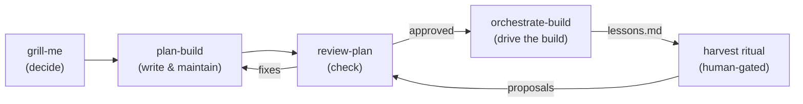

# my-agent-skills

A suite of installable Cursor/agent **skills** that cover the full lifecycle of
multi-session software work — from interrogating an idea, to writing a durable
resumable plan, to reviewing it, to driving the build with subagents.

The suite is built on an **"executable over prose"** philosophy (scripts are the
single source of truth, run by default, with a tiered fallback) framed for
**execution reliability/determinism**, plus a contained, **human-gated learning
loop**. Authoring conventions for that layer live in [`SCRIPTS.md`](SCRIPTS.md).

## The skills, in order

The four skills form a lifecycle. You rarely need all four, but they are designed
to flow into one another in this order:



### 1. `grill-me` — decide

**What:** interviews you relentlessly about a plan or design, walking each branch
of the decision tree one decision at a time, with a recommended answer for each.

**Why / when:** use it *before* anything is written, when requirements are vague or
a design has unresolved forks. It converts a fuzzy idea into a set of resolved
decisions. It ends by recommending you switch to plan mode — which is the handoff
into `plan-build`.

### 2. `plan-build` — write & maintain

**What:** the **WRITE/maintain** side of session continuity. It creates and
maintains a durable, cold-start-resumable **handoff brief tree** under
`docs/_plan/` (`HANDOFF.md` entry point + on-demand leaves: `process.md`,
`product-brief.md`, `tech-brief.md`, `phases.md`, `progress-log.md`, `lessons.md`).

**Why / when:** use it to crystallize the decisions from `grill-me` into artifacts
that *any* cold-start agent can resume from. Entry is **explicit** — an agent is
pointed at `HANDOFF.md` directly (the skill does not inject an `AGENTS.md`
pointer). It pairs with the external READ-side skills `resume-work` /
`research-repo`, which consume what it writes.

### 3. `review-plan` — check

**What:** a two-phase plan review. It triages feedback against quality gates
(Accuracy, Completeness, Concision, Precision, Clarity), applies only what you
approve, then re-reviews. Step 6 includes a **Resumability** sub-lens under Clarity
(not a sixth gate) so approved plans are cold-start executable (with external doc
pointers where appropriate). It ships `scripts/check-refs.py` to verify every cited
path/line in a plan, and an **execution-reliability lens** that flags deterministic procedure worth
turning into a script (recommend-only).

**Why / when:** run it on a `plan-build` plan (or any plan) before building, to
catch broken references, scope creep, and unclear steps while they are still cheap
to fix. Findings loop back into `plan-build`.

### 4. `orchestrate-build` — drive the build (opt-in)

**What:** the **DRIVE** side. A long-lived orchestrator breaks an approved plan into
chunks and dispatches each to a serialized cold-start **subagent** over a
handoff/handback bus, independently re-verifying, git-checkpointing, and gating on
the user via explicit escape hatches. It ships `scripts/checkpoint.sh`,
`rollback.sh`, and `run-verify.sh`.

**Why / when:** use it once an approved `plan-build` tree exists and you want the
chunk-by-chunk build automated rather than handed off manually. It **depends on**
`plan-build` and consumes its artifacts unchanged — it adds only the bus, dispatch
loop, re-verification, checkpointing, and escape hatches.

## How they connect (the throughline)

- `grill-me` resolves the **decision tree** → `plan-build` crystallizes it into a
  durable `HANDOFF.md` tree → `review-plan` **gates** that plan against the quality
  bar → `orchestrate-build` **executes** it chunk-by-chunk, reusing the
  `plan-build` artifacts unchanged.
- Every handoff between phases (and between sessions) is **explicit and
  cold-start-resumable**: the unit of continuity is `HANDOFF.md`, not an agent's
  in-context memory.
- The loop closes: each build cycle accretes a project-local `lessons.md`
  (reusable gotchas + script/verify outcomes). A periodic **human-gated harvest**
  turns recurring lessons into *proposed* edits to the skills themselves, run back
  through `review-plan`. The control plane is never auto-edited (see
  [`SCRIPTS.md`](SCRIPTS.md)).

## Executable layer & learning loop

The suite adopts scripts as the single source of truth for deterministic steps:

- **B-prime invocation:** a `SKILL.md` says "run the script; only if you cannot
  execute it, read it and do the equivalent." Execution-first, never a free choice.
- **Tiered fallback:** read/verify scripts are *execute-or-infer*; mutating scripts
  (git checkpoint/rollback, etc.) are *execute-or-STOP* — never free-hand a
  destructive operation.
- **Self-contained:** each skill owns its scripts under its own `scripts/`; there is
  no shared runtime directory (skills install individually as symlinks).
- **Learning is human-gated:** projects accrete `lessons.md`; the suite improves
  only via reviewed proposals, never automatic self-edits.

See [`SCRIPTS.md`](SCRIPTS.md) for the full authoring conventions and the harvest
ritual.

## Install

Each skill installs as a symlink into a skills path so edits in this repo take
effect immediately:

```bash
cd /path/to/my-agent-skills
for s in grill-me plan-build review-plan orchestrate-build; do
  ln -s "$PWD/$s" ~/.agents/skills/"$s"
  # optionally also: ln -s "$PWD/$s" ~/.cursor/skills/"$s"
done
```

Never place skills under `~/.cursor/skills-cursor/` — that directory is reserved
for Cursor's built-in skills.

## Repo layout

- `grill-me/` — guided-discovery interview (prose-only; interviewing is judgment).
- `plan-build/` — handoff brief tree author/maintainer (`SKILL.md`, `reference.md`,
  `templates/`).
- `review-plan/` — plan reviewer (`SKILL.md`, `reference.md`,
  `scripts/check-refs.py`).
- `orchestrate-build/` — subagent dispatch driver (`SKILL.md`, `reference.md`,
  `scripts/`, `templates/`).
- `SCRIPTS.md` — author-facing conventions for the executable layer + the
  human-gated harvest ritual.

## Design principles

- **Execution reliability over prose** — crystallize deterministic procedure into
  scripts; degrade gracefully where execution is unavailable.
- **Explicit handoff entry** — continuity rides on an explicit `HANDOFF.md`, not on
  an injected `AGENTS.md` pointer.
- **Human-gated by default** — commits, scope changes, and any self-improvement of
  the skills require explicit user approval.
- **Self-contained skills** — each skill is independently installable and carries
  its own scripts and templates.
