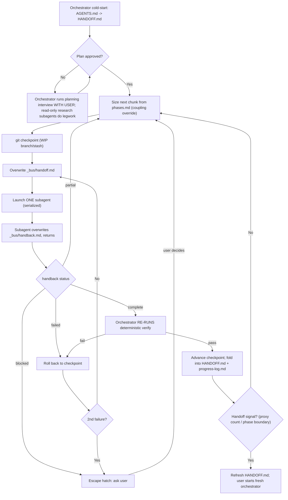

# Orchestrate-build

Automates the manual cold-start handoff loop. A long-lived **orchestrator** (this session, user-attended) breaks approved work into **chunks** and dispatches each to a **subagent** that runs as a one-shot cold-start sub-session. The subagent's context is discarded on return; only a structured **handback** comes back. The orchestrator independently re-verifies, folds durable state into the `plan-build` tree, checkpoints git, and dispatches the next chunk.

This is the DRIVE side; `plan-build` is the WRITE side. This skill reuses `plan-build` artifacts unchanged and adds only the bus, the dispatch loop, re-verification, checkpointing, and escape hatches. Rationale for every decision lives in [the proposal](../plan-build/proposals/orchestrated-subagents.md); see [reference.md](reference.md) for operational detail.

## When to use

- A `plan-build` tree exists (or you are about to plan one) and the user asks to **drive the build** chunk-by-chunk rather than hand off manually.
- Triggers: "orchestrate the build", "run the dispatch loop", "drive the subagents", "auto-run the phases".

## Prerequisites

- A `plan-build` tree exists under `docs/_handoff/` (AGENTS.md pointer, HANDOFF.md, phases.md with per-phase `Verify:` steps). If not, run the planning phase below first.
- The harness supports both **write-capable** subagents (build/test chunks) and **read-only** subagents (discovery legwork).
- The orchestrator has the same workspace + tool access as subagents, so it can re-run verifies and own git.

## Core loop

Per cycle, the orchestrator:

1. **Size the chunk** from `phases.md` (see Chunking).
2. **Checkpoint git** (WIP branch/stash) so a bad chunk is recoverable.
3. **Overwrite `docs/_handoff/_bus/handoff.md`** from `templates/handoff.md` for this one chunk.
4. **Launch exactly ONE subagent** with `templates/dispatch-prompt.md` (serialized).
5. **Receive the handback** (`docs/_handoff/_bus/handback.md`, overwritten by the subagent).
6. **Branch on the handback status** (independent of the re-verify result): `blocked` -> user gate (escape hatch 1); `partial` -> size and dispatch a continuation chunk, no rollback; `failed` -> roll back to the checkpoint, then retry or trip the circuit-breaker; `complete` -> re-verify.
7. **Re-verify a `complete` handback** independently (see Verification). On pass: advance the checkpoint, fold durable state into `HANDOFF.md` + append `progress-log.md`. On fail: roll back to the checkpoint, then retry or trip the circuit-breaker.
8. **Check the handoff signal** before sizing the next chunk.

## The bus

Two role-owned files under `docs/_handoff/_bus/`, each overwritten in place every cycle, durable for the life of the plan+build, then **deleted at the end**. Serialization (below) means there is never write contention.

- `docs/_handoff/_bus/handoff.md` - orchestrator -> subagent. The **only writer is the orchestrator**. The dispatch brief for one chunk. Template: `templates/handoff.md`.
- `docs/_handoff/_bus/handback.md` - subagent -> orchestrator. The **only writer is the subagent**. The structured return. Template: `templates/handback.md`.

Canonical project state stays in `plan-build`'s `HANDOFF.md` (current truth, overwritten) and `progress-log.md` (append-only history). Overwriting the bus loses nothing durable because `progress-log.md` carries the audit trail.

## Serialization rule

**Exactly one subagent runs at a time.** Every escape hatch (circuit-breaker, loop cap, phase-boundary pause, user gate) assumes a single in-flight chunk the orchestrator can stop before starting the next. Serial chunks cannot race on shared code or the bus, so no merge step is needed. Parallelism is deferred until serial behaviour is proven reliable and only on provably disjoint work.

## Verification

The correctness backbone: a subagent may report `complete` without actually running the check, and a trusted false pass compounds across chunks.

- **Deterministic** verify (tests, build, file exists): the orchestrator **re-runs it itself** after the handback, before advancing. This is the only ground truth.
- **Not runnable**: require verbatim evidence in the handback and inspect it.
- **Subjective** ("the design reads well"): goes to the **user gate**; the orchestrator does not self-certify.

Testing is not a separate stage: writing/running tests is just a verifiable chunk whose deterministic verify is its test.

## Workspace & git

Subagent file edits persist in the shared tree, so a failed/`partial` chunk can leave the tree broken for the next one. Re-verification detects breakage but does not recover it.

- The orchestrator records a **known-good checkpoint** before each dispatch via a WIP mechanism it owns (dedicated WIP branch, or `git stash`/tags) - never real commits unless the user asks.
- On a failed re-verify, **roll back** to the checkpoint before retry/re-dispatch. Successful chunks advance the checkpoint. **Green-on-exit** is the target for completed chunks; `partial` may leave mid-edit state.
- **Subagents never commit; the orchestrator owns git.**

## Chunking

A chunk is **the smallest unit with one deterministic verify, worth one onboarding**. The verify sets the floor; the cold-start re-read tax sets the ceiling.

- Cluster trivially small adjacent steps; split oversized ones; refine sizing from the observed `partial`-handback rate.
- **Coupling override:** when work is tightly coupled (technically or conceptually), keep that unit whole in one chunk rather than cutting it to fit a budget.
- **Hazard:** a coupled unit *larger* than a subagent budget is dangerous - any split crosses a context boundary the next subagent cannot see. **Flag it to the user; do not split silently.**

## Planning phase

If no approved plan exists, plan first (planning is interactive, so it stays user-in-the-loop):

- The **orchestrator runs the planning interview itself** (grill-me-style), because a headless subagent cannot talk to the user.
- **Read-only research subagents** do token-heavy legwork (codebase mapping, "how does X work today"); only findings return.
- Decisions and trade-offs stay with the orchestrator+user and produce an approved `phases.md`/spec via `plan-build`.
- After approval, do a deliberate orchestrator handoff so build starts on a fresh, lean orchestrator.

## Escape hatches

1. **User-in-the-loop gate.** On a `blocked` handback, surface the decision to the user rather than guessing. The ambiguous and scope-creep return-early triggers are reported via the `blocked` status.
2. **Orchestrator handoff (user-initiated).** On a deterministic proxy signal (chunks-completed count / phase boundary) plus the user watching a real usage meter, refresh `HANDOFF.md` and let the user start a fresh orchestrator. Self-assessed "context feels large" is a soft warning only, never the trigger.
3. **Failure circuit-breaker.** After two failed attempts on the same chunk, stop and ask the user.
4. **Runaway/loop cap.** Limit auto-dispatched chunks before a mandatory check-in.
5. **Phase-boundary pause.** Auto-run within an approved phase; pause at each phase boundary for approval.

## Orchestrator continuity

The orchestrator is itself a long-lived session that grows. Handing off to a fresh orchestrator is **user-initiated on the proxy signals** in escape hatch 2. The handoff reuses `plan-build`: refresh `HANDOFF.md`, and a fresh orchestrator cold-starts from it. The bus and brief tree are on disk, so nothing in flight is lost.

## Rules

- One subagent at a time; the orchestrator is the single point of control.
- Single writer per bus file; both are overwritten in place and deleted at the end.
- The orchestrator owns git and all user-facing decisions; subagents never commit and never talk to the user.
- Re-verify every deterministic check yourself before folding state.
- Do not commit unless the user asks.

## Resources

- Operational detail (chunk sizing, git mechanics, continuation re-dispatch, verification protocol, budget defaults, worked session): [reference.md](reference.md).
- Contracts: `templates/handoff.md`, `templates/handback.md`, `templates/dispatch-prompt.md`.
- Design rationale and locked decisions: [the proposal](../plan-build/proposals/orchestrated-subagents.md).
